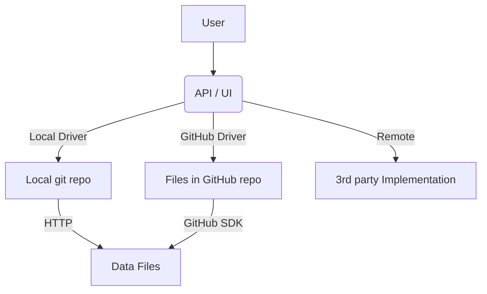

# Takoc

Takoc 是一个简化的本地数据库，用来保存具有特定类型的数据，目标是：

1. 使用 git、本地文件等方式，实现中小规模数据的管理。
2. 设计一个宽泛的数据协议，并尽可能兼容已有的协议。
3. 可视化。

## User Story

## Type System

为了更加广泛的支持不同的数据类型，我们设计了一个类型系统。

| Phase   | Description                                 | Doc                                          |
| ------- | ------------------------------------------- | -------------------------------------------- |
| Phase 1 | 以 JSON Schema 为基础，支持常见的数据类型。 | [JSON Schema](doc/typesystem/json-schema.md) |
| Phase 2 | 支持嵌入文件。                              | TODO                                         |
| Phase 3 | 支持类型转换、进化。                        | TODO                                         |

## Store

为了支持不同的存储方式，我们设计了一个存储系统。

| Phase   | Description   | Doc                                 |
| ------- | ------------- | ----------------------------------- |
| Phase 1 | 本地 git 仓库 | [Local Git](doc/store/local-git.md) |
| Phase 2 | GitHub 仓库   | TODO                                |

## API & Visualization

| Phase   | Description | Doc                         |
| ------- | ----------- | --------------------------- |
| Phase 1 | RESTful API | [API v1](doc/api/api-v1.md) |
| Phase 2 | 可视化      | TODO                        |
| Phase 3 | 鉴权        | TODO                        |
