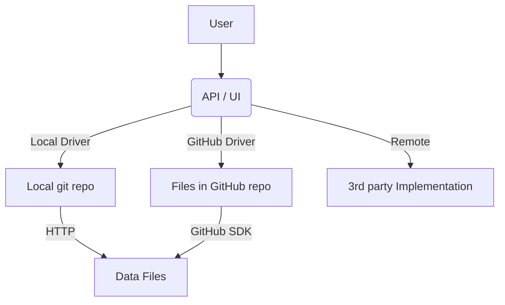

# Takoc

Takoc is a simplified local database for storing typed data with the following goals:

1. Manage small to medium-scale data using local files, github and other methods.
2. Design a flexible data protocol that is compatible with existing protocols as much as possible.
3. Provide visualization capabilities.

## User Story

## Type System

To support a wide range of different data types, we have designed a type system.

| Phase   | Description                                         | Doc                                          |
| ------- | --------------------------------------------------- | -------------------------------------------- |
| Phase 1 | Based on JSON Schema, supporting common data types. | [JSON Schema](doc/typesystem/json-schema.md) |
| Phase 2 | Support embedded files.                             | TODO                                         |
| Phase 3 | Support type conversion and evolution.              | TODO                                         |

## Store

To support different storage methods, we have designed a storage system.

| Phase   | Description          | Doc                                 |
| ------- | -------------------- | ----------------------------------- |
| Phase 1 | Local git repository | [Local Git](doc/store/local-git.md) |
| Phase 2 | GitHub repository    | TODO                                |

## API & Visualization

| Phase   | Description    | Doc                         |
| ------- | -------------- | --------------------------- |
| Phase 1 | RESTful API    | [API v1](doc/api/api-v1.md) |
| Phase 2 | Visualization  | TODO                        |
| Phase 3 | Authentication | TODO                        |
