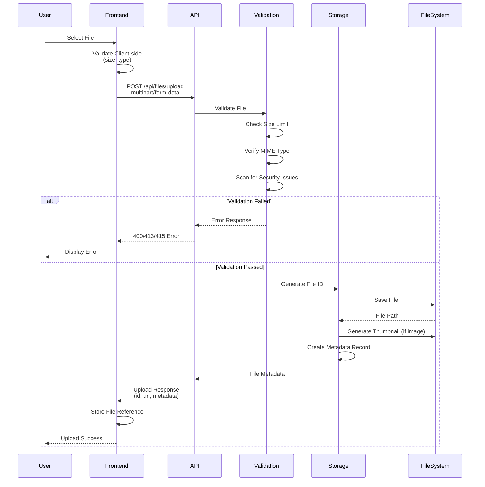

# File Store Design

## Overview

Support for built-in file data type that allows users to upload files and reference them within records.

## System Architecture

```mermaid
graph TB
    subgraph "Client Layer"
        User[User]
        Frontend[Frontend Application]
    end

    subgraph "API Layer"
        UploadAPI[POST /api/files/upload]
        DownloadAPI[GET /api/files/{id}/download]
        MetadataAPI[GET /api/files/{id}]
        UpdateAPI[PUT /api/files/{id}]
        DeleteAPI[DELETE /api/files/{id}]
        ListAPI[GET /api/files]
    end

    subgraph "Service Layer"
        FileService[File Service]
        ValidationService[Validation Service]
        StorageService[Storage Service]
        SecurityService[Security Service]
    end

    subgraph "Storage Layer"
        LocalStorage[Local Storage]
        CloudStorage[Cloud Storage]
        TempStorage[Temporary Storage]
    end

    subgraph "Outputs"
        UploadResponse[Upload Response]
        FileMetadata[File Metadata]
        DownloadStream[File Download Stream]
        Error[Error Response]
    end

    User -->|Upload File| Frontend
    Frontend -->|multipart/form-data| UploadAPI
    UploadAPI -->|Validate| ValidationService
    ValidationService -->|Check Size, Type, Security| SecurityService
    SecurityService -->|Store| StorageService
    StorageService -->|Save File| LocalStorage
    StorageService -->|Save File| CloudStorage
    StorageService -->|Return Metadata| FileService
    FileService -->|JSON Response| UploadResponse

    User -->|Download File| Frontend
    Frontend -->|Request| DownloadAPI
    DownloadAPI -->|Get File| StorageService
    StorageService -->|Retrieve| LocalStorage
    StorageService -->|Retrieve| CloudStorage
    StorageService -->|Stream| DownloadStream

    User -->|View Metadata| Frontend
    Frontend -->|Request| MetadataAPI
    MetadataAPI -->|Query| FileService
    FileService -->|Return| FileMetadata

    User -->|Update Info| Frontend
    Frontend -->|PUT| UpdateAPI
    UpdateAPI -->|Update| FileService
    FileService -->|Return| FileMetadata

    User -->|Delete File| Frontend
    Frontend -->|DELETE| DeleteAPI
    DeleteAPI -->|Remove| StorageService
    StorageService -->|Delete| LocalStorage
    StorageService -->|Delete| CloudStorage

    User -->|List Files| Frontend
    Frontend -->|Query| ListAPI
    ListAPI -->|Filter| FileService
    FileService -->|Return| FileMetadata

    style User fill:#e1f5ff
    style Frontend fill:#fff4e1
    style UploadResponse fill:#e8f5e9
    style FileMetadata fill:#e8f5e9
    style DownloadStream fill:#e8f5e9
    style Error fill:#ffebee
```

## Data Flow Diagram



## File Type as Built-in Data Type

### Core File Type

The `file` type is a first-class data type in the system with the following characteristics:

```json
{
    "type": "file",
    "properties": {
        # Unique identifier for the file
        "id": "string"
    }
}
```

## Storage Structure

The root directory for file storage is `takoc/files`, you can configure it in `takoc.yaml`.
The id is the relative path to the file in the storage directory.

For example:

```
takoc.yaml
takoc/
├── ...
mynamespace/               # Namespace directory
└── ...
anothernamespace/          # Another Namespace directory
└── ...
files
```

## Security Considerations

## Frontend Integration

### File Upload Component

```typescript
interface FileUploadProps {
  onUpload: (file: File) => Promise<FileUploadResponse>;
  acceptedTypes: string[];
  maxSize: number;
  multiple?: boolean;
}

// Usage example
<FileUpload
  acceptedTypes={["image/*", "application/pdf"]}
  maxSize={10 * 1024 * 1024} // 10MB
  multiple={true}
  onUpload={handleFileUpload}
/>;
```

### File Display Component

```typescript
interface FileDisplayProps {
  file: FileData;
  showPreview?: boolean;
  downloadable?: boolean;
}

// Different display modes based on file type
<FileDisplay file={fileData} showPreview={true} />;
```

## Performance Considerations

### Optimization Strategies

- **Lazy Loading**: Load file metadata first, content on demand
- **Thumbnail Generation**: Generate thumbnails for images
- **CDN Integration**: Serve static files through CDN
- **Compression**: Compress files where appropriate
- **Caching**: Cache file metadata and thumbnails

### Scalability

- **Horizontal Scaling**: Support multiple storage backends
- **Load Balancing**: Distribute file serving across servers
- **Background Processing**: Handle thumbnail generation asynchronously
- **Monitoring**: Track storage usage and performance metrics

## Error Handling

### Common File Errors

- **File Too Large**: Return 413 status with size limit information
- **Invalid File Type**: Return 415 status with allowed types
- **Storage Full**: Return 507 status with cleanup suggestions
- **File Not Found**: Return 404 status
- **Access Denied**: Return 403 status

### Error Response Format

```json
{
  "error": {
    "code": "FILE_TOO_LARGE",
    "message": "File size exceeds maximum limit of 10MB",
    "details": {
      "max_size": 10485760,
      "actual_size": 15728640
    }
  }
}
```
